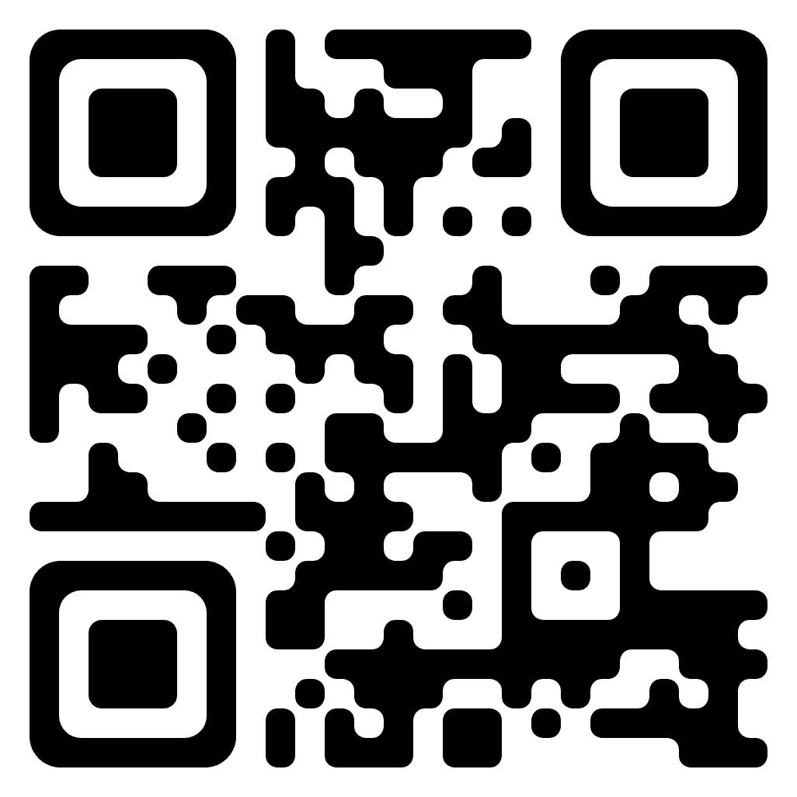

# Шо ми бажаємо отримати:

Сервер, на якому буде:
- MQTT-брокер для обміну __зарядна станція__ <-> __додаток__
- база даних (mongoDB) Зараз не задіяна
- worker (NodeJS?) Зараз не задіян

QR-код для додатку генерується зі ссилки вигляді:
`https://charger.navi.cc/#stantion_id`

Тренуємось на (https://charger.navi.cc/#id001)

## Тестовий прилад

Для відлагодження, або для демонстраціі, на сервері треба запустити бота.

## Протокол

Протокол тут:  [PROTOCOL](PROTOCOL.md)

